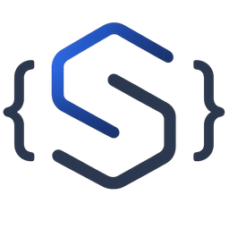

# @aviasole/shapecraft

Structured output generation for LLMs in Node.js. Token-level constraints for local models, native JSON modes for cloud APIs — one unified API.

[](https://www.npmjs.com/package/@aviasole/shapecraft)
[](https://github.com/aviasoletechnologies/shapecraft/actions/workflows/ci.yml)
[](LICENSE)


## Install

```bash
npm install @aviasole/shapecraft zod
# or: pnpm add @aviasole/shapecraft zod
```

`zod` is an optional peer dependency, used for the Zod schema examples throughout this README - install it too if you're using Zod schemas (the common path): `npm install zod`.

Install backend SDK as needed:

```bash
npm install openai              # OpenAI, Fireworks, Mistral, OpenRouter, DeepSeek, Together, Cerebras, Grok, openaiCompatible
npm install groq-sdk            # Groq
npm install @anthropic-ai/sdk   # Anthropic
npm install @google/genai       # Gemini
npm install node-llama-cpp      # Local .gguf models
# Ollama: no extra SDK needed
```

## Quick Start

```typescript
import { z } from "zod";
import { generate, openai } from "@aviasole/shapecraft";

const PersonSchema = z.object({
  name: z.string(),
  age: z.number(),
  email: z.string().email(),
});

const model = openai({ model: "gpt-4o-mini" });

const result = await generate(model, PersonSchema, "Extract: John Doe, 32, john@example.com");

console.log(result.data);           // { name: "John Doe", age: 32, email: "john@example.com" }
console.log(result.guaranteeLevel); // "native"
console.log(result.attempts);       // 1
```

## Documentation

Full guide and reference docs — schema inputs, backends & guarantee levels, streaming, `createClient()` & middleware, batch generation, result metadata, timeouts, pluggable validation, the staged validation pipeline, FHIR presets, turnaround, skill-based generation, multi-agent orchestration, tool calling, the CLI, and error handling: **[aviasoletechnologies.github.io/shapecraft](https://aviasoletechnologies.github.io/shapecraft/)**

## Backends & Guarantee Levels

| Backend | Guarantee | Mechanism |
|---|---|---|
| `openai()` | `native` | Server-side strict JSON schema |
| `groq()` | `native` | JSON mode |
| `deepseek()` | `native` | JSON mode (no schema-strict mode, same tier as `groq()`) |
| `fireworks()` | `native` | Server-side JSON schema mode, plus a real token-level GBNF grammar mode |
| `mistral()` | `native` | Server-side JSON schema mode |
| `gemini()` | `native` | Server-side JSON schema mode (`responseJsonSchema`) |
| `ollama()` | `constrained` | Token-level JSON-schema constraint |
| `llamaCpp()` | `constrained` | Token-level GBNF grammar (local `.gguf` via node-llama-cpp) |
| `anthropic()` | `best-effort` | Prompt + parse + retry |
| `openRouter()` | `best-effort` | Pass-through to many providers - `response_format` support varies by underlying model |
| `together()` | `native` | Server-side JSON schema mode |
| `cerebras()` | `native` | Server-side strict JSON schema mode |
| `grok()` | `native` | Server-side JSON schema mode |
| `openaiCompatible()` | `best-effort` (override to `native` if your provider enforces it) | Generic factory - see below |

> `llamaCpp()` is `constrained` for a `{ gbnf }` input (token-level). For other schema
> types (Zod / jsonSchema / …) it currently runs a best-effort prompt path until the
> JSON-Schema→GBNF converter lands — treat those as best-effort despite the nominal level.
>
> `fireworks()` is the one cloud backend where a `{ gbnf }` input is *not* downgraded to
> best-effort — Fireworks' grammar mode (`response_format: { type: "grammar", grammar }`)
> applies the GBNF grammar as a genuine token-level constraint server-side, the same
> guarantee `llamaCpp()` gives locally. It reuses the `openai` package pointed at
> Fireworks' base URL, so no extra SDK dependency is needed.
>
> `openRouter()` is deliberately `best-effort`, not `native` like the other cloud
> backends — it's pass-through across many different underlying providers/models, and
> `response_format: { type: "json_schema" }` enforcement isn't guaranteed for every model
> it can route to, only the ones that actually support it themselves.
>
> `gemini()` uses the official `@google/genai` SDK, not an OpenAI-compatible endpoint
> (unlike `fireworks()`/`mistral()`/`openRouter()`) — Gemini's OpenAI-compat layer is a
> migration bridge for OpenAI users, not its primary integration path, and doesn't expose
> `responseJsonSchema` (plain JSON Schema, what `toJsonSchema()` already produces) —
> only the older `responseSchema` (Gemini's own Type-enum OpenAPI-subset shape).
>
> `together()`/`cerebras()`/`grok()` all reuse the `openai` package pointed at their
> respective base URLs, same pattern as `fireworks()`/`mistral()`/`openRouter()` - no new
> SDK dependency. None expose a genuine grammar/constrained-decoding mode, so a `{ gbnf }`
> input on any of the three is prompt-only best-effort, same as `openai()`/`groq()`.

### `openaiCompatible()`

For any OpenAI-compatible provider shapecraft doesn't name explicitly - `baseURL`,
`apiKey`, and `model` are all caller-supplied instead of hardcoded per provider:

```typescript
import { openaiCompatible } from "@aviasole/shapecraft";

const custom = openaiCompatible({
  baseURL: "https://api.some-provider.example/v1",
  apiKey: process.env.SOME_PROVIDER_API_KEY,
  model: "some-model-id",
  guaranteeLevel: "native", // optional - omit to default to "best-effort"
});
```

Defaults to `guaranteeLevel: "best-effort"` since shapecraft can't verify an arbitrary
endpoint actually enforces `json_schema` server-side. Pass `guaranteeLevel: "native"`
explicitly if you know your provider does, for accurate reporting. Unlike the named
backends, there's no environment-variable fallback for the API key - there's no single
conventional env-var name for an arbitrary provider, so `apiKey` is required.

```typescript
import { openai, groq, fireworks, mistral, gemini, openRouter, deepseek, ollama, anthropic, llamaCpp, together, cerebras, grok, openaiCompatible } from "@aviasole/shapecraft";

const gpt       = openai({ model: "gpt-4o-mini" });
const fast      = groq({ model: "llama-3.3-70b-versatile" });
const cloudGbnf = fireworks({ model: "accounts/fireworks/models/llama-v3p1-70b-instruct" });
const mist      = mistral({ model: "mistral-large-latest" });
const gem       = gemini({ model: "gemini-flash-latest" });
const router    = openRouter({ model: "openai/gpt-4o-mini" });
const deep      = deepseek({ model: "deepseek-v4-flash" });
const local     = ollama({ model: "llama3.2" });
const native    = llamaCpp({ modelPath: "./models/llama-3.2-3b.gguf" });
const claude    = anthropic({ model: "claude-haiku-4-5-20251001", maxRetries: 3 });
```

Every built-in backend also exposes `capabilities` (`streaming`/`chat`/`structuredOutput`/`toolCalling`/`skillDispatch`) - an explicit, inspectable alternative to duck-typing `typeof model.generateStream === "function"` for routing logic. See the [Backends & Guarantee Levels guide](https://aviasoletechnologies.github.io/shapecraft/guide/backends) for the full mechanism breakdown and the `ModelCapabilities` interface, and [what shapecraft guarantees and what it doesn't](https://aviasoletechnologies.github.io/shapecraft/reference/guarantees) for the structural-vs-semantic-correctness distinction.

## How shapecraft compares

Other libraries solve overlapping parts of this problem well. This is what's actually different, not a scorecard:

| Capability | Instructor-js | zod-gpt | Vercel AI SDK (`generateObject`) | shapecraft |
|---|---|---|---|---|
| Providers | OpenAI only | OpenAI, Anthropic | OpenAI, Anthropic, Google, and more | OpenAI, Groq, Fireworks, Mistral, OpenRouter, DeepSeek, Together, Cerebras, xAI, Gemini, Anthropic, Ollama, llama.cpp, any OpenAI-compatible endpoint |
| Local model support | - | - | no grammar-level constraint | Ollama / llama.cpp with token-level GBNF grammar |
| Per-provider reliability signal | - | - | - | `guaranteeLevel`: `native` / `constrained` / `best-effort` |
| Retry on schema failure | not documented | fixed 3 attempts, 60s timeout | configurable `maxRetries` | configurable, only on schema-validation failure |
| Timeout / cancellation | not documented | hardcoded 60s | via provider fetch options | `timeoutMs` / `AbortSignal`, enforced at the core regardless of backend |
| Streaming | yes | - | yes (`streamObject`) | yes, with per-field incremental validation |
| Schema input types | Zod only | Zod only | Zod, Valibot, JSON schema | Zod, JSON schema, regex, custom validator, XML, GBNF |

The gap that actually matters: none of the others tell you *how much* to trust a given provider's structured output, or give local models the same real enforcement cloud providers get. shapecraft's `guaranteeLevel` makes that explicit instead of leaving it as something you find out in production.

## What's included

- **Schema inputs**: Zod, raw JSON Schema, regex pattern, custom validator, XML (with template placeholders and `enforceLiterals`), raw GBNF grammar
- **Streaming**: `generateStream()` with per-field incremental validation, visible retries on validation failure
- **`createClient()` & middleware**: a Koa-style onion pipeline for logging, caching, and other cross-cutting concerns
- **Batch generation**: `generateBatch()`, concurrency-capped, `Promise.allSettled`-style
- **Result metadata**: `provider`, `model`, `latencyMs` on every result
- **Timeouts & cancellation**: `timeoutMs` / `AbortSignal`, enforced at the core for every backend
- **Pluggable JSON Schema validation**: swap in your own validator (or AJV) via `jsonSchemaValidator`
- **Staged validation pipeline**: `semanticValidator`, `confidenceScorer`, `postProcessors` on top of structural validation
- **FHIR R4 presets**: `Patient`, `Observation`, `Condition`, `MedicationRequest`, `Encounter`, via `@aviasole/shapecraft/fhir`, including a common `extension?: Extension[]` field
- **Turnaround**: multi-turn collection via `generate(..., { turnaround: true })`, validated once over the whole transcript
- **Skill-based generation**: `SkillRegistry` + `generateSkillCall()`/`runSkillLoop()` for model-driven dispatch to typed operations
- **Multi-agent orchestration**: `defineAgent()` + `runAgents()` for chaining validated `generate()` calls, via `@aviasole/shapecraft/agentic`
- **Tool calling**: `generateWithTools()` for native provider function-calling with validated arguments and a validated final answer
- **CLI**: `npx shapecraft validate --schema schema.json --output output.json`

Full docs for all of the above: **[aviasoletechnologies.github.io/shapecraft](https://aviasoletechnologies.github.io/shapecraft/)**

## Error Handling

```typescript
import { SchemaViolationError, MaxRetriesExceededError } from "@aviasole/shapecraft";

try {
  const result = await generate(model, schema, prompt, { maxRetries: 3 });
} catch (err) {
  if (err instanceof MaxRetriesExceededError) {
    console.error(`Failed after ${err.attempts} attempts`);
  }
  if (err instanceof SchemaViolationError) {
    console.error("Raw output:", err.raw);
    console.error("Errors:", err.validationErrors);
  }
}
```

See the [Error Handling guide](https://aviasoletechnologies.github.io/shapecraft/guide/error-handling) and [Options reference](https://aviasoletechnologies.github.io/shapecraft/reference/options) for the full list of `generate()` options.

## License

Apache-2.0 © Aviasole Technologies
